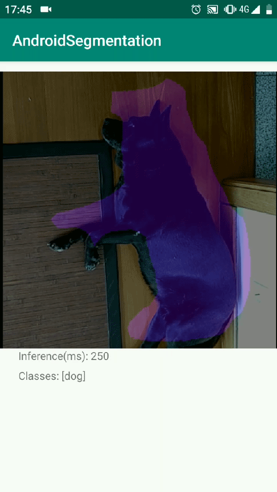
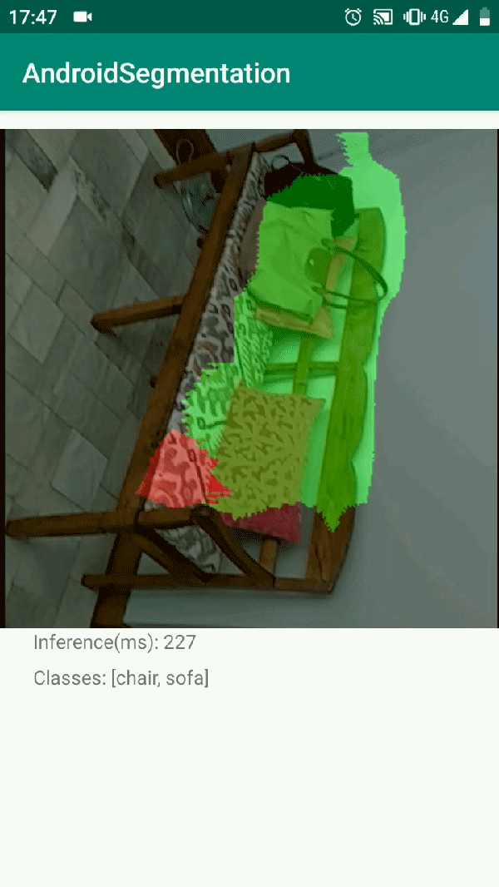
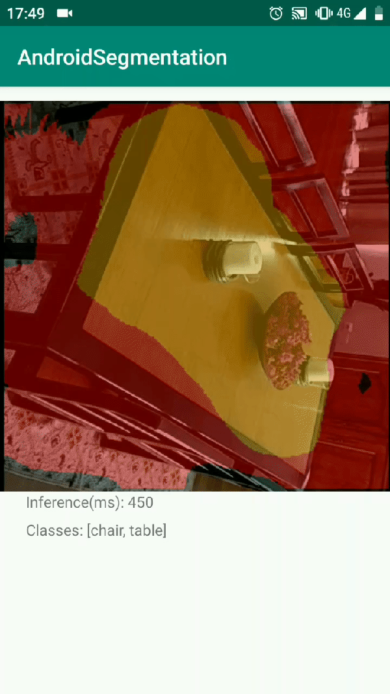

# Android Video Segmentation
Android video semantic segmentation using OpenCV(for image preprocessing and camera handling) and Google´s trained Deeplab3+(for video frame segmentation).

  
## Demos

### Helpful Resources:
* Use of quantized version of deeplab3+(for better inference speed): https://github.com/tantara/JejuNet
* Visualize .tflite model structure/inputs/outputs: https://github.com/lutzroeder/netron
* Fix opencv camera: https://heartbeat.fritz.ai/working-with-the-opencv-camera-for-android-rotating-orienting-and-scaling-c7006c3e1916
